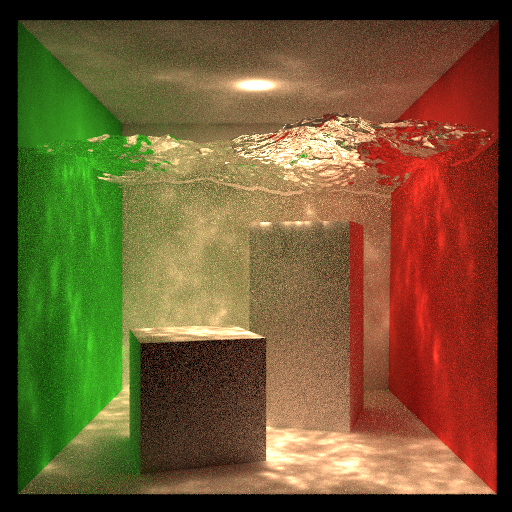

# Photon Mapping

### Intro

Reproduction of *[Photon Mapping](https://legacy.sites.fas.harvard.edu/~cs278/papers/pmap.pdf)* Algorithm in C++.

### Features

- Photon map + path tracing solution
  - Light sampling for direct illumination
  - Path tracing for indirect illumination (with final gathering technique)
    - Diffuse BSDF
      - Caustics photon map for caustics ($Light(Specular)^+Diffuse$ paths)
      - Global photon map ($Light(Specular|Diffuse)^*Diffuse$ paths)
      - Final gathering (For reducing low-frequency noise)
    - Specular BSDF
      - Path tracing

- Ability to load .obj models

### Requirements

- C++ (>=20)

- CMake(>=3.20)

- [Embree](https://github.com/embree/embree) (>=3) 

  Recommend to use [vcpkg](https://github.com/microsoft/vcpkg/blob/master/README.md) for installing Embree.

  ```
  > vcpkg install embree3
  ```

### Build

The program has been tested on Windows 11 with VS2022.

In VS2022 Developer Command Prompt:

#### With vcpkg

```
> cmake -B build -S . "-DCMAKE_TOOLCHAIN_FILE=[path to vcpkg]/scripts/buildsystems/vcpkg.cmake" -DCMAKE_BUILD_TYPE=Release ..
> cd build
> msbuild photon_mapping.sln /p:CppLanguageStandard=stdcpp20
```

#### Without vcpkg

```
> mkdir build
> cd build
> cmake -DCMAKE_BUILD_TYPE=Release ..
> msbuild photon_mapping.sln /p:CppLanguageStandard=stdcpp20
```

NOTE: My own testing is under the first circumstance. If you try to build without vcpkg, make sure to build Embree first.

### Run

Place .obj model under `build/build/Debug`(It may vary on different devices. Totally, it should be the same directory as "main.exe".) and run

```
./main 512 512 16 100000 50 2 50 4 5
```

NOTE: 

- Arguments (in order): 
  - **512**: Output image width 
  - **512**: Output image height 
  - **16**: SPP (samples per pixel)
  - **100000**: Number of photons used for building global photon map
  - **50**: Number of photons for estimation in global photon map
  - **2**: Multiplier for caustics photon map (Thus, number of photons used for building caustics photon map should be 2 * 100k = 200k)
  - **50**: Number of photons for estimation in caustics photon map
  - **4**: Maximum recursive depth of final gathering
  - **5**: Maximum recursive depth of photon tracing and path tracing

- The more photons, recursive depth and SPP are set, the more time is needed to render a result. 

### Results

Arguments for `output1.png`(in order): 512 512 16 10000 30 10 30 4 40



### Reference

- [PBRT](https://pbr-book.org/3ed-2018/Light_Transport_III_Bidirectional_Methods/Stochastic_Progressive_Photon_Mapping)
- Jensen, Henrick Wann. [*Global illumination using photon maps*](https://legacy.sites.fas.harvard.edu/~cs278/papers/pmap.pdf) , 1996
- yumcyaWiz's repository of [photon_mapping](https://github.com/yumcyaWiz/photon_mapping?tab=readme-ov-file) on github.

### License

This software is licensed under MIT license. See ``LICENSE`` file for detail.